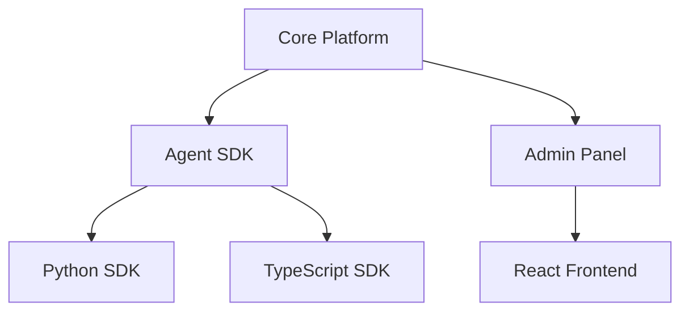

# 📚 Roadmap Guidelines for Open Source Projects

## Why is a Roadmap Important?

A roadmap is a public declaration of a project's intentions. It helps:
- **Contributors** - understand where the project is heading
- **Users** - plan adoption and migrations
- **Maintainers** - coordinate efforts and priorities
- **Sponsors** - evaluate ROI from supporting the project

## 🎯 Best Practices

### 1. Choosing a Format

#### Timeline-based
```markdown
## 2024
### Q1 (Jan-Mar)
- Feature A
- Bug fixes batch #1

### Q2 (Apr-Jun)
- Feature B
- Performance improvements
```
**When to use**: When you have clear deadlines or dependencies on external factors

#### Milestone-based (Versions)
```markdown
## v1.0.0 - Stable Release
- Core functionality
- Basic documentation
- Test coverage >80%

## v2.0.0 - Enterprise Edition
- Multi-tenancy
- Advanced security
```
**When to use**: For projects with semantic versioning

#### Now/Next/Later
```markdown
## Now (active development)
- Telegram integration
- Bug fixes

## Next (next quarter)
- Plugin system
- API v2

## Later (long-term plans)
- Machine learning features
- Global CDN
```
**When to use**: For flexible planning without rigid dates

### 2. Item Structure

Each roadmap item should include:

```markdown
### 🚀 [Feature Name] - Priority: High
**Description**: Brief description of the functionality
**Status**: In Progress | Planned | Done | On Hold
**Assignee**: @username (optional)
**Issue/PR**: #123
**Target**: v2.0 | Q2 2024
**Dependencies**: Feature X must be completed first
```

### 3. Visual Indicators

#### Status Emojis
- 🚀 In Progress - active development
- 📅 Planned - scheduled
- ✅ Completed - done
- 🔄 On Hold - paused
- ❌ Cancelled - cancelled
- 🧪 Experimental - experimental feature
- 🐛 Bug Fix - bug fixes
- 📚 Documentation - documentation
- 🔒 Security - security

#### Progress Bars
```markdown
### Database Migration
Progress: [████████░░] 80%
- [x] Schema design
- [x] Migration scripts
- [x] Data validation
- [ ] Performance testing
```

### 4. GitHub Integration

#### GitHub Projects
```yaml
# .github/workflows/update-roadmap.yml
name: Sync Roadmap with Projects
on:
  project_card:
    types: [moved]
```

#### Automatic Linking
```markdown
### Feature X ([#123](https://github.com/org/repo/issues/123))
Automatically linked to:
- Related PR: #124
- Discussion: #125
```

#### Milestones
```markdown
## [Milestone: v2.0](https://github.com/org/repo/milestone/1)

```

### 5. Community Engagement

#### RFC Process
```markdown
## Proposed Features (RFC)
Before adding to roadmap, features go through RFC:
1. Create RFC issue with template
2. Community discussion (min 2 weeks)
3. Core team review
4. Vote (if needed)
5. Add to roadmap or reject
```

#### Voting Mechanism
```markdown
## Community Priority Vote 🗳️
React with emoji to vote:
- 👍 High Priority
- 👎 Low Priority
- ❤️ Love this feature
- 🚀 Ship it ASAP

Top voted features for Q2:
1. Dark mode (45 👍)
2. API v2 (38 👍)
3. Plugin system (31 👍)
```

### 6. Transparency & Communication

#### Regular Updates
```markdown
## 📅 Last Updated: March 18, 2024
### Recent Changes:
- Moved "Feature X" to Q3 due to dependencies
- Added "Security Audit" as high priority
- Completed "Kubernetes migration"

### Next Review: April 1, 2024
```

#### Blockers & Risks
```markdown
### ⚠️ Known Blockers
- **LLM API costs**: Waiting for budget approval
- **Kubernetes expertise**: Need DevOps contributor
- **Legal review**: Terms of Service update pending
```

### 7. Technical Details

#### Dependencies Graph


#### Architecture Decision Records (ADR)
```markdown
### Architectural Decisions
- [ADR-001](docs/adr/001-agent-communication.md): Agent Communication Protocol
- [ADR-002](docs/adr/002-database-choice.md): PostgreSQL vs MongoDB
```

### 8. Success Metrics

```markdown
## Success Criteria
### Q1 2024 Goals
- [ ] User adoption: 1000+ active installations
- [ ] Performance: <100ms p99 latency
- [ ] Community: 50+ contributors
- [ ] Documentation: 100% API coverage
- [ ] Testing: >85% code coverage
```

### 9. Examples of Successful Roadmaps

#### Next.js
- Uses GitHub Discussions for RFC
- Quarterly planning cycles
- Clear migration guides

#### Kubernetes
- Special Interest Groups (SIGs)
- KEP (Kubernetes Enhancement Proposals)
- Detailed graduation criteria

#### Rust
- 6-week release cycles
- Stabilization process
- Edition planning (2015, 2018, 2021)

### 10. Roadmap Tools

#### GitHub Native
- **Projects**: Kanban boards
- **Milestones**: Version planning
- **Issues**: Task tracking
- **Discussions**: Community input

#### External Tools
- **Productboard**: Feature prioritization
- **Canny**: User feedback collection
- **Linear**: Issue tracking with roadmap
- **Notion**: Flexible documentation

#### Visualization
- **Gantt charts**: Complex dependencies
- **Roadmap.sh style**: Interactive web roadmaps
- **Mermaid diagrams**: In-markdown charts

### 11. ROADMAP.md Template

```markdown
# 🗺️ Project Name Roadmap

## 🎯 Vision
One paragraph description of where we're heading

## 📊 Current Status: Beta/Stable/LTS
Brief description of current state

## 🚀 Current Focus (Q1 2024)

### In Progress 🏗️
- [ ] Feature A ([#123](link)) - @assignee
  - Description and acceptance criteria
  - Progress: [██████░░░░] 60%

### Completed ✅
- [x] Feature B ([PR #124](link))
  - Shipped in v1.2.0

## 📅 Upcoming (Q2 2024)

### High Priority 🔥
- [ ] Critical feature
- [ ] Security update

### Medium Priority 📌
- [ ] Nice to have feature
- [ ] Performance improvement

## 🔮 Future Considerations

Long-term vision items without dates

## 📈 Success Metrics

How we measure progress

## 🤝 How to Contribute

Links to contribution guide

## 💬 Get Involved

- GitHub Discussions: [link]
- Discord/Slack: [link]
- Office Hours: Every Tuesday 3pm UTC
```

### 12. Anti-patterns (What to Avoid)

❌ **Overpromising**: Don't promise features without realistic estimation
❌ **Too detailed**: A roadmap is not a project plan
❌ **Never updating**: A stale roadmap is worse than none
❌ **Ignoring feedback**: Community input is critical
❌ **No priorities**: Not everything can be "High Priority"
❌ **Missing context**: Explain "why", not just "what"

### 13. Internationalization

```markdown
# Roadmap
[🇬🇧 English](ROADMAP.md) | [🇺🇦 Ukrainian](ROADMAP.ua.md) | [🇪🇸 Español](ROADMAP.es.md)

Or use multilingual sections:
## Feature X / Функція X / Función X
```

### 14. Automation

#### GitHub Actions for Roadmap
```yaml
name: Roadmap Automation
on:
  issues:
    types: [labeled]

jobs:
  update-roadmap:
    if: github.event.label.name == 'roadmap'
    runs-on: ubuntu-latest
    steps:
      - uses: actions/checkout@v2
      - name: Update ROADMAP.md
        run: |
          # Script to add issue to roadmap
```

### 15. Review Process

```markdown
## Roadmap Review Process
1. **Monthly**: Status updates, blocker resolution
2. **Quarterly**: Priority adjustment, new items
3. **Annually**: Vision alignment, major pivots

### Review Checklist
- [ ] All "In Progress" items have updates
- [ ] Completed items moved to changelog
- [ ] New community requests evaluated
- [ ] Dependencies and blockers identified
- [ ] Success metrics reviewed
```

## Summary

A good roadmap is a living document that:
- ✅ Clearly communicates project direction
- ✅ Engages community in planning
- ✅ Gets updated regularly
- ✅ Balances ambitions with reality
- ✅ Transparently shows progress and blockers

Remember: it's better to under-promise and over-deliver than the opposite!