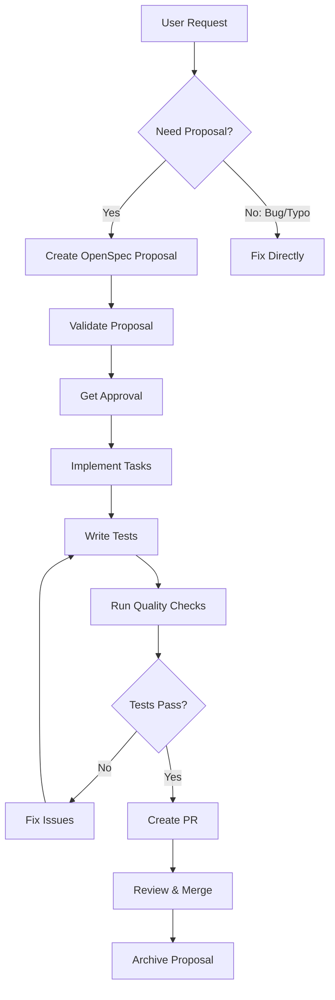

# Development Workflow Guidelines

## Core Workflow Principles

### 1. Database Changes - Migration First
**CRITICAL**: All database schema changes MUST be implemented through migrations.

- Never modify database schema directly
- Create migrations using: `php bin/console make:migration`
- Review migration SQL before applying
- Test migrations in development environment first
- Include rollback strategy in complex migrations
- Document breaking changes in migration comments

Example workflow:
```bash
# 1. Create migration
php bin/console make:migration

# 2. Review generated migration
cat migrations/Version*.php

# 3. Apply migration
php bin/console doctrine:migrations:migrate

# 4. Verify schema
php bin/console doctrine:schema:validate
```

### 2. Test-Driven Development (TDD)
**REQUIREMENT**: Every new feature MUST have automated tests before implementation.

Test hierarchy:
1. Unit tests for business logic
2. Integration tests for API/services
3. Functional tests for user flows
4. E2E tests for critical paths

Testing checklist:
- [ ] Write test scenarios BEFORE implementation
- [ ] Cover happy path and edge cases
- [ ] Test error handling and validation
- [ ] Verify database transactions
- [ ] Check permissions and security

### 3. Quality Gates - Tests Must Pass
**MANDATORY**: All tests MUST pass before creating pull requests.

Quality checks sequence:
```bash
# 1. PHPStan analysis (level 8, zero errors)
vendor/bin/phpstan analyse

# 2. Code style check
vendor/bin/php-cs-fixer check

# 3. Run all tests
vendor/bin/codecept run

# 4. Convention compliance (if applicable)
make conventions-test

# 5. E2E tests (if applicable)
make e2e
```

### 4. Pull Request Creation
**STANDARD**: Every PR MUST be based on the OpenSpec specification.

PR requirements:
- Title: Clear, action-oriented (e.g., "Add two-factor authentication")
- Description template:

```markdown
## OpenSpec Reference
- Change ID: `add-feature-name`
- Proposal: openspec/changes/add-feature-name/proposal.md
- Tasks completed: X/Y

## Summary
[1-3 bullet points from proposal]

## Changes
- [List of key changes implemented]
- [Reference to affected specs]

## Testing
- [ ] Unit tests pass
- [ ] Integration tests pass
- [ ] Manual testing completed
- [ ] Migration tested and reversible

## Documentation
- [ ] Code comments added
- [ ] API documentation updated
- [ ] User documentation created (if applicable)
```

### 5. Continuous Integration Within Active Proposals
**IMPORTANT**: All changes within an active (non-archived) proposal should be continuously committed and pushed.

Active proposal workflow:
```bash
# 1. Make changes
edit files...

# 2. Commit frequently with descriptive messages
git add .
git commit -m "feat(auth): implement JWT token generation

Part of add-two-factor-auth proposal"

# 3. Push to feature branch
git push origin feature/add-two-factor-auth

# 4. Keep PR updated
gh pr edit --body "Updated implementation, X/Y tasks complete"
```

## Sandbox & Long-Running Tasks Best Practices

### Development Environment Isolation

Use Docker containers for isolated development:
```yaml
# .devcontainer/docker-compose.yml
services:
  workspace:
    isolation: default
    volumes:
      - ..:/workspace
    environment:
      - APP_ENV=dev
```

### Long-Running Task Management

For tasks > 10 minutes:
1. Use background processing
2. Implement progress tracking
3. Add timeout handling
4. Log progress periodically
5. Allow graceful cancellation

Example pattern:
```php
class LongRunningTaskHandler
{
    public function execute(string $taskId): void
    {
        $this->updateProgress($taskId, 0, 'Starting...');

        foreach ($items as $i => $item) {
            $this->processItem($item);
            $this->updateProgress($taskId, ($i / count($items)) * 100);

            if ($this->shouldCancel($taskId)) {
                $this->cleanup();
                return;
            }
        }

        $this->updateProgress($taskId, 100, 'Complete');
    }
}
```

### Agent Development Sandboxing

Agents should be developed in isolation:
- Use separate Docker containers per agent
- Isolated database schemas (prefix tables)
- Separate configuration files
- Independent testing suites
- Clear interface contracts

## OpenSpec Integration Workflow

### Complete Development Cycle



### Task Tracking Template

```markdown
## Implementation Progress

### Phase 1: Setup
- [ ] Create database migrations
- [ ] Setup configuration
- [ ] Create base classes/interfaces

### Phase 2: Core Implementation
- [ ] Implement business logic
- [ ] Add validation rules
- [ ] Handle error cases

### Phase 3: Testing
- [ ] Write unit tests
- [ ] Write integration tests
- [ ] Manual testing

### Phase 4: Documentation
- [ ] Code documentation
- [ ] API documentation
- [ ] User guide (if applicable)

### Phase 5: Quality & Release
- [ ] PHPStan check (level 8)
- [ ] Code style fix
- [ ] All tests pass
- [ ] Create PR with spec reference
```

## ROADMAP Management

### ROADMAP Workflow
The project maintains a central `ROADMAP.md` file that tracks all major initiatives, features, and technical debt.

**CRITICAL**: Every completed task or new initiative MUST update the ROADMAP.

#### When to Update ROADMAP
1. **Completing a feature** - Move from "In Progress" to "Completed"
2. **Starting new work** - Add to appropriate quarter/milestone
3. **Discovering technical debt** - Add to "Technical Debt" section
4. **Planning future work** - Add to "Future Initiatives"
5. **Blocking issues** - Document in "Blockers" section

#### ROADMAP Structure
```markdown
## Q1 2025
### Completed ✅
- [x] Feature name (openspec-change-id)

### In Progress 🚧
- [ ] Feature name (openspec-change-id) - X/Y tasks

### Planned 📋
- [ ] Feature name - priority level

## Technical Debt
- [ ] Refactoring needed...

## Blockers 🔴
- Issue description - impact
```

#### Update Process
```bash
# 1. Before starting work - check ROADMAP
cat ROADMAP.md

# 2. Update status when completing
# Edit ROADMAP.md to move item to Completed

# 3. Commit ROADMAP changes with work
git add ROADMAP.md
git commit -m "chore: update ROADMAP - completed feature-name"

# 4. In PR description reference ROADMAP
"Updates ROADMAP.md - moves X to completed"
```

### ROADMAP Best Practices
1. **Keep it current** - Update immediately when status changes
2. **Link to OpenSpec** - Reference change IDs for traceability
3. **Show progress** - Use task counters (X/Y) for transparency
4. **Prioritize clearly** - Mark P0 (critical), P1 (high), P2 (medium)
5. **Review weekly** - Team should review and adjust priorities
6. **Archive old items** - Move completed items to archive section quarterly

### ROADMAP Integration with OpenSpec

When creating new OpenSpec proposals:
1. Check ROADMAP for related/conflicting work
2. Add proposal to ROADMAP "In Progress" section
3. Update ROADMAP when proposal is archived

When completing work:
1. Update OpenSpec proposal status
2. Update ROADMAP status
3. Ensure both stay synchronized

Example workflow:
```bash
# Starting new feature
openspec list                    # Check active work
cat ROADMAP.md                    # Check planned work
# Create proposal if not conflicting
# Add to ROADMAP "In Progress"

# Completing feature
openspec archive feature-id --yes  # Archive proposal
# Update ROADMAP - move to Completed
git add ROADMAP.md openspec/
git commit -m "feat: complete feature-id, update ROADMAP"
```

## Conflict Resolution

### CLAUDE.md vs AGENTS.md Hierarchy

1. **AGENTS.md** - Authoritative source for:
   - OpenSpec workflow
   - Spec format and conventions
   - Cross-agent standards
   - Repository-wide processes

2. **CLAUDE.md** - Extends with:
   - Claude-specific permissions
   - Tool auto-approval rules
   - Claude environment details
   - Does NOT override AGENTS.md

Resolution strategy:
- AGENTS.md defines WHAT and WHY
- CLAUDE.md defines HOW for Claude specifically
- When in conflict, AGENTS.md wins
- Document exceptions explicitly

## Best Practices Summary

### DO:
✅ Create migrations for ALL database changes
✅ Write tests BEFORE implementation
✅ Validate specs with `openspec validate --strict`
✅ Commit and push frequently within active proposals
✅ Reference specs in all PRs
✅ Use Docker for isolation
✅ Track progress with detailed task lists
✅ Update ROADMAP when starting/completing work
✅ Keep ROADMAP synchronized with OpenSpec

### DON'T:
❌ Modify database directly
❌ Create PRs without passing tests
❌ Skip OpenSpec proposals for new features
❌ Implement without approval
❌ Ignore failing quality checks
❌ Mix multiple proposals in one PR
❌ Leave tasks unmarked when complete
❌ Forget to update ROADMAP
❌ Start work that conflicts with ROADMAP priorities

## Quick Reference Commands

```bash
# OpenSpec workflow
openspec list                          # View active changes
openspec validate [change] --strict    # Validate proposal
openspec show [change]                  # View details
openspec archive [change] --yes        # Archive completed

# Database
php bin/console make:migration         # Create migration
php bin/console doctrine:migrations:migrate  # Apply migrations
php bin/console doctrine:schema:validate    # Verify schema

# Testing
vendor/bin/phpstan analyse             # Static analysis
vendor/bin/php-cs-fixer check          # Code style
vendor/bin/codecept run                # All tests
vendor/bin/codecept run Unit           # Unit tests only
vendor/bin/codecept run Integration    # Integration tests

# Git workflow
git add .                               # Stage changes
git commit -m "feat: description"      # Commit with message
git push origin feature/branch-name    # Push to remote
gh pr create --title "Title" --body "Body"  # Create PR
```

## Implementation Priority

When implementing a new feature:

1. **Spec First**: Create/update OpenSpec proposal
2. **Migration**: Database schema changes
3. **Tests**: Write test scenarios
4. **Implementation**: Build the feature
5. **Documentation**: Update docs
6. **Quality**: Run all checks
7. **PR**: Create with spec reference
8. **Iterate**: Address review feedback
9. **Merge**: After approval
10. **Archive**: Mark proposal complete

This workflow ensures consistency, quality, and maintainability across the entire platform.