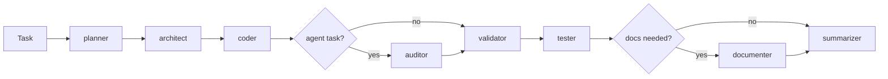

# Мультиагентний пайплайн

## Огляд

Пайплайн — це автоматизована система виконання задач через послідовність AI-агентів. Кожен агент має свою роль: планування, архітектура, код, аудит, валідація, тести, документація і фінальний підсумок по задачі.

```
Задача → Planner → Architect → Coder → [Auditor] → Validator → Tester → [Documenter] → Summarizer
```

Пайплайн автоматично визначає складність задачі та підбирає потрібний набір агентів.



## Швидкий старт

```bash
# Одна задача
make pipeline TASK="Add retry logic to LiteLLM client"

# Або напряму
./scripts/pipeline.sh "Add retry logic to LiteLLM client"

# З аудитом
./scripts/pipeline.sh --audit "Create new hello-agent"

# Пакетний запуск (окрема документація: pipeline-batch.md)
make pipeline-batch FILE=tasks.txt
```

## Автоматичне планування

Перший крок — **Planner** агент (Opus 4.6, 5 хв ліміт). Він аналізує задачу і генерує `plan.json` з конфігурацією пайплайну.

### Профілі

| Профіль | Коли | Агенти |
|---------|------|--------|
| `quick-fix` | Дрібні правки, конфіг, 1-3 файли | coder → validator → summarizer |
| `standard` | Нова фіча, один додаток, кілька файлів | architect → coder → validator → tester → summarizer |
| `complex` | Міжсервісні зміни, міграції, API, нові агенти | architect → coder → auditor → validator → tester → summarizer |

### Як Planner вирішує

1. Читає опис задачі
2. Шукає згадані файли/паттерни в коді (glob/grep)
3. Перевіряє існуючі OpenSpec пропозиції
4. Оцінює кількість файлів, додатків, сервісів
5. Визначає чи потрібні міграції та зміни API
6. Генерує `.opencode/pipeline/plan.json`

### plan.json

```json
{
  "profile": "standard",
  "reasoning": "New feature in single app, needs spec and tests",
  "agents": ["architect", "coder", "validator", "tester", "summarizer"],
  "skip_openspec": false,
  "estimated_files": 8,
  "apps_affected": ["knowledge-agent"],
  "needs_migration": false,
  "needs_api_change": true,
  "is_agent_task": true,
  "timeout_overrides": {},
  "model_overrides": {}
}
```

### Пропуск планування

```bash
# Вказати профіль вручну
./scripts/pipeline.sh --profile quick-fix "Fix typo in README"

# Пропустити planner
./scripts/pipeline.sh --skip-planner "Implement openspec change add-streaming"
```

## Агенти

### Таблиця моделей Builder

Для shared ролей Builder навмисно повторює ті самі `primary` і базові fallback-и, що й Ultraworks.

| Агент | Workflow | Primary | Fallback 1 | Fallback 2 | Fallback 3 |
|-------|----------|---------|------------|------------|------------|
| `planner` | `Builder only` | `anthropic/claude-opus-4-6` | `openai/gpt-5.4` | `opencode-go/glm-5` | `minimax/MiniMax-M2.7` |
| `architect` | `Builder + Ultraworks` | `anthropic/claude-opus-4-6` | `openai/gpt-5.4` | `opencode-go/glm-5` | `minimax/MiniMax-M2.7` |
| `coder` | `Builder + Ultraworks` | `anthropic/claude-sonnet-4-6` | `minimax/MiniMax-M2.7` | `openai/gpt-5.3-codex` | `opencode-go/glm-5` |
| `validator` | `Builder + Ultraworks` | `minimax/MiniMax-M2.5-highspeed` | `openai/gpt-5.2` | `opencode-go/kimi-k2.5` | `opencode/minimax-m2.5-free` |
| `tester` | `Builder + Ultraworks` | `opencode-go/kimi-k2.5` | `openai/gpt-5.3-codex` | `minimax/MiniMax-M2.7-highspeed` | `opencode/big-pickle` |
| `auditor` | `Builder + Ultraworks` | `anthropic/claude-opus-4-6` | `openai/gpt-5.4` | `opencode-go/glm-5` | `minimax/MiniMax-M2.7` |
| `documenter` | `Builder + Ultraworks` | `openai/gpt-5.4` | `anthropic/claude-sonnet-4-6` | `google/gemini-3-flash-preview` | `minimax/MiniMax-M2.5` |
| `summarizer` | `Builder + Ultraworks` | `openai/gpt-5.4` | `anthropic/claude-opus-4-6` | `google/gemini-3.1-pro-preview` | `minimax/MiniMax-M2.7` |

### Planner (5 хв)
- **Модель**: Opus 4.6
- **Роль**: аналізує складність, генерує план
- **Вихід**: `.opencode/pipeline/plan.json`

### Architect (45 хв)
- **Модель**: Opus 4.6
- **Роль**: створює OpenSpec пропозицію (proposal, design, tasks, specs)
- **Вихід**: `openspec/changes/<id>/`
- **Пропускається**: якщо задача каже "Implement openspec change ..." (spec вже готовий)

### Coder (60 хв)
- **Модель**: Sonnet 4.6
- **Роль**: пише код, міграції, конфіги
- **Вхід**: spec з OpenSpec або handoff.md
- **Stage gate**: перевіряє, що coder реально змінив файли

### Validator (20 хв)
- **Модель**: MiniMax M2.5 Highspeed
- **Роль**: PHPStan level 8 + CS Fixer, виправляє всі помилки
- **Цикл**: cs-fix → cs-check → analyse → повторити до нуля помилок

### Tester (30 хв)
- **Модель**: Kimi K2.5
- **Роль**: запускає тести, пише відсутні, виправляє помилки
- **Цілі**: Codeception (PHP), pytest (Python), convention-test

### Auditor (20 хв)
- **Модель**: Opus 4.6
- **Роль**: перевірка якості та відповідності стандартам платформи
- **Чекліст**: Structure, Testing, Config, Security, Observability, Docs
- **Вихід**: звіт з вердиктами PASS/WARN/FAIL
- **Активація**: `--audit`, профіль `complex`, або автоматично для задач з агентами

### Documenter (15 хв)
- **Модель**: GPT-5.4
- **Роль**: оновлює двомовну документацію (UA + EN)
- **Не потрібен за замовчуванням**: coder сам пише docs з tasks.md

### Summarizer (15 хв)
- **Модель**: GPT-5.4
- **Роль**: формує фінальний markdown-підсумок по всіх агентах, які реально працювали над задачею
- **Вихід**: `tasks/summary/<timestamp>-<task-slug>.md`
- **Що містить**: хто що зробив, складнощі, що ще треба виправити, і пропозицію до наступної задачі

## Автоматичний аудит для агентів

Коли задача стосується створення або зміни агента, пайплайн **автоматично додає auditor після coder**. Це працює через три механізми:

1. **Planner**: встановлює `is_agent_task: true` в plan.json
2. **Keyword detection**: шукає "agent"/"агент" в описі задачі
3. **apps_affected**: перевіряє чи є додатки з суфіксом `-agent`

```
standard + agent task:
  architect → coder → [auditor] → validator → tester → summarizer
```

Аудитор перевіряє зміни за чеклістами:
- `checklist-php.md` — 51 перевірка для PHP/Symfony агентів
- `checklist-python.md` — 47 перевірок для Python/FastAPI агентів
- `checklist-platform.md` — 13 платформних перевірок

Щоб примусово додати аудит для будь-якої задачі:

```bash
./scripts/pipeline.sh --audit "Any task description"
```

## Handoff — передача контексту між агентами

Файл `.opencode/pipeline/handoff.md` — спільний документ, який кожен агент оновлює:

| Агент | Що записує |
|-------|-----------|
| Architect | change-id, apps affected, DB/API changes |
| Coder | files modified, migrations created, deviations |
| Validator | PHPStan/CS results |
| Tester | test results, new tests |
| Auditor | audit verdict, recommendations |
| Documenter | docs created, final status |
| Summarizer | summary file path, підсумок по агентах, next-task recommendation |

## Опції запуску

| Опція | Опис |
|-------|------|
| `--skip-architect` | Пропустити архітектора (spec вже є) |
| `--from <agent>` | Продовжити з конкретного агента |
| `--only <agent>` | Запустити тільки одного агента |
| `--branch <name>` | Своя назва гілки |
| `--task-file <path>` | Задача з файлу (для довгих промтів) |
| `--audit` | Додати аудитора |
| `--profile <name>` | Вказати профіль вручну |
| `--skip-planner` | Не запускати planner |
| `--no-commit` | Не робити автокоміти між агентами |
| `--resume` | Продовжити з checkpoint |
| `--telegram` | Telegram-сповіщення |
| `--webhook <url>` | Webhook-сповіщення |

## Моніторинг

### Консольний монітор

```bash
./scripts/pipeline-monitor.sh
```

Інтерактивний TUI-монітор з вкладками:

| Вкладка | Опис |
|---------|------|
| 1:Overview | Статус задач, прогрес-бар, стан батчу |
| 2:Activity | Хронологія подій: задачі, агенти, воркери (час, тривалість, статус) |
| 3+:worker-N | Логи кожного паралельного воркера (динамічні) |

Клавіші навігації:

| Клавіша | Дія |
|---------|-----|
| `←/→` | Перемикання вкладок |
| `↑/↓` | Вибір задачі у списку |
| `Enter` | Деталі задачі |
| `Esc/q` | Назад / вихід |
| `s` | Запустити батч (або додатковий воркер) |
| `f` | Перезапустити зафейлені задачі |
| `k` | Зупинити батч |
| `l` | Переглянути логи обраної задачі (failed/in-progress) |
| `d` | Видалити задачу |
| `a` | Архівувати завершені |
| `+/-` | Змінити пріоритет todo-задачі |

### Stability Guards

Для `Ultraworks` окремо діє wrapper стабільності в `builder/monitor/ultraworks-monitor.sh`.

Він дає:
- wall-clock timeout через `ULTRAWORKS_MAX_RUNTIME` (default `7200`)
- stall watchdog через `ULTRAWORKS_STALL_TIMEOUT` (default `900`)
- перевірку двох сигналів прогресу: ріст task log і оновлення `.opencode/pipeline/handoff.md`
- автоматичний post-mortem summary + normalizer після fail/timeout/stall

Практично це означає, що навіть якщо `Sisyphus` або дочірній subagent підвис, launcher повинен залишити:
- task log у `.opencode/pipeline/logs/`
- summary у `builder/tasks/summary/*.md`

Корисні змінні середовища:

```bash
ULTRAWORKS_MAX_RUNTIME=7200
ULTRAWORKS_STALL_TIMEOUT=900
ULTRAWORKS_WATCHDOG_INTERVAL=30
```

Статус батчу показує час виконання, PID і кількість воркерів:
`Running (3m 42s, PID 12345, 2 workers)`

Коли задачі чекають і батч не запущено:
`Not running — 3 tasks waiting, press [s] to start`

### Моніторинг через Dev Reporter

```
http://localhost:8087/admin/pipeline
```

Кожен pipeline автоматично відправляє результати через A2A до dev-reporter-agent.

### Перегляд логів

```bash
# Логи конкретного запуску
ls .opencode/pipeline/logs/

# Формат: <timestamp>_<agent>.log
cat .opencode/pipeline/logs/20260311_140000_coder.log

# Звіти
ls .opencode/pipeline/reports/
```

### Telegram-сповіщення

```bash
export PIPELINE_TELEGRAM_BOT_TOKEN="your-bot-token"
export PIPELINE_TELEGRAM_CHAT_ID="your-chat-id"

./scripts/pipeline.sh --telegram "Task description"
```

Сповіщення на кожному етапі: старт, завершення агента, фінал.

## Tasks — принципи роботи

### Lifecycle задачі

```
Задача (текст або .md файл)
    ↓
pipeline.sh створює гілку: pipeline/<task-slug>
    ↓
Кожен агент: виконує → комітить → checkpoint
    ↓
Результат: COMPLETED або FAILED at <agent>
    ↓
Звіт: .opencode/pipeline/reports/<timestamp>.md
    ↓
Task summary: tasks/summary/<timestamp>-<task-slug>.md
```

### Checkpoint & Resume

Після кожного агента зберігається checkpoint (`tasks/artifacts/<task-slug>/checkpoint.json`):

```json
{
  "task": "Add streaming support",
  "branch": "pipeline/add-streaming",
  "started": "2026-03-11 04:00:00",
  "agents": {
    "architect": {"status": "done", "duration": 180, "commit": "abc123"},
    "coder": {"status": "done", "duration": 900, "commit": "def456"},
    "validator": {"status": "failed", "duration": 120}
  }
}
```

Для продовження з місця збою:

```bash
./scripts/pipeline.sh --from validator --branch pipeline/add-streaming "Add streaming support"
```

### Git workflow

- Кожна задача — окрема гілка `pipeline/<task-slug>`
- Кожен агент комітить свою роботу: `[pipeline:coder] add-streaming`
- Stage gate після coder: перевіряє що є реальні зміни коду
- Після coder запускаються міграції (якщо є)

## Фолбек моделей

Каскадна система при помилках (429, timeout):

```
Підписки (Claude, Codex)     ← оплачені, першими
    ↓ помилка
Безкоштовні (free tier)       ← без витрат
    ↓ помилка
Платні per-token (cheap tier) ← останній варіант
```

Налаштування через змінні середовища:

```bash
PIPELINE_FALLBACK_ARCHITECT="claude-sonnet,gpt-5.3-codex,free,cheap"
PIPELINE_FALLBACK_CODER="gpt-5.3-codex,claude-opus,free,cheap"
```

## Таймаути

| Агент | За замовчуванням | Змінна |
|-------|-----------------|--------|
| Planner | 5 хв | `PIPELINE_TIMEOUT_PLANNER` |
| Architect | 45 хв | `PIPELINE_TIMEOUT_ARCHITECT` |
| Coder | 60 хв | `PIPELINE_TIMEOUT_CODER` |
| Validator | 20 хв | `PIPELINE_TIMEOUT_VALIDATOR` |
| Tester | 30 хв | `PIPELINE_TIMEOUT_TESTER` |
| Auditor | 20 хв | `PIPELINE_TIMEOUT_AUDITOR` |
| Documenter | 15 хв | `PIPELINE_TIMEOUT_DOCUMENTER` |

## Бюджет токенів та витрат

```bash
# Ліміт загальної вартості (USD)
PIPELINE_MAX_COST=5.00

# Ліміт токенів на агента
PIPELINE_TOKEN_BUDGET_CODER=2000000
PIPELINE_TOKEN_BUDGET_ARCHITECT=500000
```

## Приклади

### Швидкий фікс

```bash
./scripts/pipeline.sh "Fix typo in hello-agent README"
# Planner → quick-fix: coder → validator
```

### Нова фіча в одному додатку

```bash
./scripts/pipeline.sh "Add health check endpoint to knowledge-agent"
# Planner → standard: architect → coder → validator → tester
```

### Новий агент (автоматичний аудит)

```bash
./scripts/pipeline.sh "Create new summarizer-agent with FastAPI"
# Planner → standard + is_agent_task: architect → coder → auditor → validator → tester
```

### Складна міжсервісна зміна

```bash
./scripts/pipeline.sh "Add centralized session management across all agents"
# Planner → complex: architect → coder → validator → tester → auditor
```

### Продовжити після збою

```bash
./scripts/pipeline.sh --from tester --branch pipeline/add-health-check \
  "Add health check endpoint to knowledge-agent"
```

### Тільки один агент

```bash
./scripts/pipeline.sh --only validator "Run PHPStan on core"
```

## Структура файлів

```
scripts/
├── pipeline.sh              # Основний оркестратор
├── pipeline-batch.sh        # Пакетний запуск
├── pipeline-run-task.sh     # Запуск однієї задачі в worktree
├── pipeline-monitor.sh      # Інтерактивний TUI-монітор
└── pipeline-stats.sh        # Статистика

.opencode/
├── pipeline/
│   ├── profiles.json        # Профілі (quick-fix, standard, complex)
│   ├── handoff.md           # Контекст між агентами
│   ├── plan.json            # Вихід planner (runtime)
│   ├── tasks.example.txt    # Приклад файлу задач
│   ├── logs/                # Логи агентів
│   └── reports/             # Звіти запусків
└── agents/
    ├── planner.md           # Промт planner
    ├── architect.md         # Промт architect
    ├── coder.md             # Промт coder
    ├── validator.md         # Промт validator
    ├── tester.md            # Промт tester
    └── documenter.md        # Промт documenter
```
