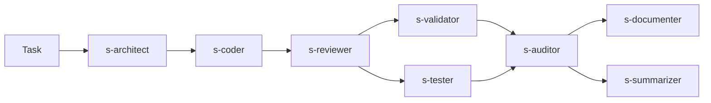

# Oh My OpenCode (OmO) — Multi-Model Agent Orchestration

## Overview

[Oh My OpenCode](https://github.com/code-yeongyu/oh-my-openagent) (OmO) is an open-source plugin for OpenCode that orchestrates multiple AI models through specialized discipline agents. We adopted it because our builder pipeline arrived at the same multi-agent concept independently, but OmO implements it more maturely.

OmO provides Sisyphus — an orchestrator that delegates to subagents in parallel, with fallback chains across providers. Combined with our OpenSpec-driven pipeline agents, this gives the platform two complementary workflows:

1. **Sequential pipeline** (`/pipeline`) — manual agent switching, human controls each phase
2. **Sisyphus pipeline** (`/auto`, `ultrawork`) — fully automatic, parallel execution

## Architecture

```
.opencode/
├── oh-my-opencode.jsonc          # OmO config: agents, categories, fallback, concurrency
├── opencode.json                 # OpenCode config: LSP (PHP Intelephense)
│
├── skills/                       # Shared knowledge (both workflows)
│   ├── coding/SKILL.md           #   Tech stack, per-app make targets
│   ├── testing/SKILL.md          #   Codeception/pytest patterns, coverage
│   ├── validation/SKILL.md       #   PHPStan, CS-fixer targets
│   ├── auditing/SKILL.md         #   S/T/C/X/O/D checklist, severity
│   ├── openspec/SKILL.md         #   Spec format, proposal scaffold
│   └── documentation/SKILL.md    #   Bilingual patterns, INDEX.md rules
│
├── agents/                       # All agents
│   ├── planner.md                #   Pipeline: analyzes task → plan.json
│   ├── architect.md              #   Pipeline: OpenSpec proposals
│   ├── coder.md                  #   Pipeline: implements code
│   ├── validator.md              #   Pipeline: PHPStan + CS fix
│   ├── tester.md                 #   Pipeline: tests + coverage
│   ├── auditor.md                #   Pipeline: audit + fix
│   ├── documenter.md             #   Pipeline: bilingual docs
│   ├── summarizer.md             #   Pipeline: final summary
│   ├── s-architect.md            #   Sisyphus: specs (delegated)
│   ├── s-coder.md                #   Sisyphus: code (delegated)
│   ├── s-reviewer.md             #   Sisyphus: safe code-improvement pass
│   ├── s-validator.md            #   Sisyphus: lint (parallel)
│   ├── s-tester.md               #   Sisyphus: tests (parallel)
│   ├── s-auditor.md              #   Sisyphus: audit (read-only)
│   ├── s-documenter.md           #   Sisyphus: docs (parallel)
│   └── s-summarizer.md           #   Sisyphus: summary (parallel)
│
├── commands/                     # Slash commands
│   ├── auto.md                   #   /auto — full Sisyphus pipeline
│   ├── implement.md              #   /implement — skip architect
│   ├── validate.md               #   /validate — quality gate only
│   ├── audit.md                  #   /audit — audit loop only
│   ├── finish.md                 #   /finish — resume from state
│   └── pipeline.md               #   /pipeline — manual sequential
│
└── pipeline/                     # Runtime artifacts
    ├── handoff.md                #   Shared bus between agents
    └── reports/                  #   Audit reports per run
```

## Setup

### Devcontainer (automatic)

Everything installs automatically:
- **Dockerfile**: `tmux`, `intelephense` (PHP LSP)
- **post-create.sh**: `bunx oh-my-opencode install --no-tui --claude=max5`

### Manual

```bash
bunx oh-my-opencode install          # interactive TUI
npm install -g intelephense          # PHP LSP for agents
```

### Verify

```bash
opencode --version                                    # 1.0.150+
cat ~/.config/opencode/opencode.json                  # "oh-my-opencode" in plugins
intelephense --version                                # PHP LSP active
```

## Workflows

### 1. Sisyphus (automatic)

The primary workflow. Sisyphus orchestrates all phases with parallel execution:

```
/auto <task description>
```
or simply: `ultrawork`



**Phases:**
1. **Spec** — s-architect creates OpenSpec proposal (skipped if tasks.md exists)
2. **Implement** — s-coder writes code from specs
3. **Improvement** — s-reviewer performs a safe refactor/improvement pass
4. **Quality** — s-validator + s-tester run in parallel
5. **Audit loop** — s-auditor finds issues → s-coder/s-reviewer fix → re-audit (max 3x)
6. **Finalize** — s-documenter + s-summarizer run in parallel; summarizer always writes `builder/tasks/summary/*.md`

**Shortcuts:**
| Command | What it does |
|---------|-------------|
| `ultrawork` / `ulw` | Full pipeline (phases 1-6) |
| `/implement <change-id>` | Phases 2-6 (tasks.md exists) |
| `/validate` | Phase 4 only (quality gate) |
| `/audit` | Phase 5 only (audit loop) |
| `/finish` | Resume from handoff.md state |

### Ultraworks Stability

`Ultraworks` now runs behind a dedicated stability wrapper in [builder/monitor/ultraworks-monitor.sh](/workspaces/ai-community-platform/builder/monitor/ultraworks-monitor.sh):

- global wall-clock timeout via `ULTRAWORKS_MAX_RUNTIME` (default: `7200`)
- stall watchdog via `ULTRAWORKS_STALL_TIMEOUT` (default: `900`)
- the watchdog checks both task-log growth and `.opencode/pipeline/handoff.md` updates
- if progress stops, the wrapper terminates `opencode run`, then triggers post-mortem summary generation and summary normalization
- a failed or stalled run should still leave `builder/tasks/summary/*.md`, not just logs

Useful env vars:

```bash
ULTRAWORKS_MAX_RUNTIME=7200
ULTRAWORKS_STALL_TIMEOUT=900
ULTRAWORKS_WATCHDOG_INTERVAL=30
```

Headless example:

```bash
./builder/monitor/ultraworks-monitor.sh headless "$(cat builder/tasks/todo/my-task.md)"
```

### Ultraworks Model Table

| Agent | Workflow | Primary | Fallback 1 | Fallback 2 | Fallback 3 |
|-------|----------|---------|------------|------------|------------|
| `sisyphus` | `Ultraworks only` | `opencode-go/glm-5` | `anthropic/claude-opus-4-6` | `openai/gpt-5.4` | `minimax/MiniMax-M2.7` |
| `s-architect` | `Ultraworks` | `anthropic/claude-opus-4-6` | `openai/gpt-5.4` | `opencode-go/glm-5` | `minimax/MiniMax-M2.7` |
| `s-coder` | `Ultraworks` | `anthropic/claude-sonnet-4-6` | `minimax/MiniMax-M2.7` | `openai/gpt-5.3-codex` | `opencode-go/glm-5` |
| `s-reviewer` | `Ultraworks only` | `minimax/MiniMax-M2.7` | `openai/gpt-5.4` | `opencode-go/glm-5` | `opencode/big-pickle` |
| `s-validator` | `Ultraworks` | `minimax/MiniMax-M2.5-highspeed` | `openai/gpt-5.2` | `opencode-go/kimi-k2.5` | `opencode/minimax-m2.5-free` |
| `s-tester` | `Ultraworks` | `opencode-go/kimi-k2.5` | `openai/gpt-5.3-codex` | `minimax/MiniMax-M2.7-highspeed` | `opencode/big-pickle` |
| `s-auditor` | `Ultraworks` | `anthropic/claude-opus-4-6` | `openai/gpt-5.4` | `opencode-go/glm-5` | `minimax/MiniMax-M2.7` |
| `s-documenter` | `Ultraworks` | `openai/gpt-5.4` | `anthropic/claude-sonnet-4-6` | `google/gemini-3-flash-preview` | `minimax/MiniMax-M2.5` |
| `s-summarizer` | `Ultraworks` | `openai/gpt-5.4` | `anthropic/claude-opus-4-6` | `google/gemini-3.1-pro-preview` | `minimax/MiniMax-M2.7` |

### 2. Sequential pipeline (manual)

For when you want control over each phase:

```
/pipeline <task description>
```

Each agent runs one at a time. You switch agents manually (Tab → @agent).

## Model Strategy

Each agent uses the optimal model for its role, with automatic fallback:

| Agent | Primary Model | Purpose |
|-------|--------------|---------|
| Sisyphus | `opencode-go/glm-5` | long-horizon orchestration |
| Architect | `anthropic/claude-opus-4-6` | OpenSpec, architecture, planning |
| Coder | `anthropic/claude-sonnet-4-6` | primary code implementation |
| Reviewer | `minimax/MiniMax-M2.7` | safe refactor, SOLID/DRY/KISS improvements |
| Validator | `minimax/MiniMax-M2.5-highspeed` | fast static-analysis loop |
| Tester | `opencode-go/kimi-k2.5` | tests, CUJ/E2E reasoning |
| Auditor | `anthropic/claude-opus-4-6` | read-only audit |
| Documenter | `openai/gpt-5.4` | documentation writing |
| Summarizer | `openai/gpt-5.4` | final analysis + summary |

Fallback triggers automatically on rate limits (`model_fallback: true`).

## Built-in MCPs

Installed with oh-my-opencode, always on:
- **Exa** — web search
- **Context7** — official docs lookup
- **Grep.app** — GitHub code search

## LSP

PHP Intelephense configured in `.opencode/opencode.json`:
```json
{
  "lsp": {
    "php": {
      "command": ["intelephense", "--stdio"],
      "extensions": [".php"]
    }
  }
}
```

Agents get: diagnostics, go-to-definition, find references, type inference for all PHP code.

## Configuration

| File | Purpose |
|------|---------|
| `.opencode/opencode.json` | OpenCode core config (LSP, plugins) |
| `.opencode/oh-my-opencode.jsonc` | OmO config (agents, fallbacks, concurrency, tmux) |
| `~/.config/opencode/oh-my-opencode.jsonc` | Personal overrides |

## Links

- Repository: [code-yeongyu/oh-my-openagent](https://github.com/code-yeongyu/oh-my-openagent)
- Installation guide: [docs/guide/installation.md](https://github.com/code-yeongyu/oh-my-openagent/blob/dev/docs/guide/installation.md)
