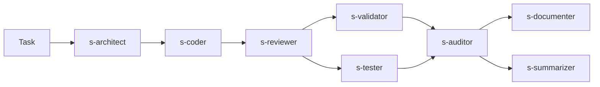

# Oh My OpenCode (OmO) — Мульти-модельна оркестрація агентів

## Огляд

[Oh My OpenCode](https://github.com/code-yeongyu/oh-my-openagent) (OmO) — це open-source плагін для OpenCode, який оркеструє кілька AI-моделей через спеціалізованих дисциплінарних агентів. Ми прийняли його тому що наш builder pipeline прийшов до тієї ж ідеї незалежно, але OmO реалізує це більш зріло.

OmO надає Sisyphus — оркестратор, який делегує субагентам паралельно, з fallback-ланцюгами між провайдерами. Разом з нашими OpenSpec-driven pipeline агентами, це дає платформі два комплементарних workflow:

1. **Послідовний pipeline** (`/pipeline`) — ручне переключення агентів, людина контролює кожну фазу
2. **Sisyphus pipeline** (`/auto`, `ultrawork`) — повністю автоматичний, паралельне виконання

## Архітектура

```
.opencode/
├── oh-my-opencode.jsonc          # OmO конфіг: агенти, категорії, fallback, concurrency
├── opencode.json                 # OpenCode конфіг: LSP (PHP Intelephense)
│
├── skills/                       # Спільні знання (обидва workflow)
│   ├── coding/SKILL.md           #   Тех стек, per-app make targets
│   ├── testing/SKILL.md          #   Codeception/pytest патерни, покриття
│   ├── validation/SKILL.md       #   PHPStan, CS-fixer targets
│   ├── auditing/SKILL.md         #   S/T/C/X/O/D чеклист, severity
│   ├── openspec/SKILL.md         #   Формат специфікацій, scaffold
│   └── documentation/SKILL.md    #   Білінгвальні патерни, INDEX.md правила
│
├── agents/                       # Всі агенти
│   ├── planner.md                #   Pipeline: аналіз задачі → plan.json
│   ├── architect.md              #   Pipeline: OpenSpec пропозиції
│   ├── coder.md                  #   Pipeline: реалізація коду
│   ├── validator.md              #   Pipeline: PHPStan + CS fix
│   ├── tester.md                 #   Pipeline: тести + покриття
│   ├── auditor.md                #   Pipeline: аудит + виправлення
│   ├── documenter.md             #   Pipeline: білінгвальні доки
│   ├── summarizer.md             #   Pipeline: фінальний summary
│   ├── s-architect.md            #   Sisyphus: специфікації (делегований)
│   ├── s-coder.md                #   Sisyphus: код (делегований)
│   ├── s-reviewer.md             #   Sisyphus: safe code-improvement pass
│   ├── s-validator.md            #   Sisyphus: лінт (паралельно)
│   ├── s-tester.md               #   Sisyphus: тести (паралельно)
│   ├── s-auditor.md              #   Sisyphus: аудит (read-only)
│   ├── s-documenter.md           #   Sisyphus: доки (паралельно)
│   └── s-summarizer.md           #   Sisyphus: summary (паралельно)
│
├── commands/                     # Slash команди
│   ├── auto.md                   #   /auto — повний Sisyphus pipeline
│   ├── implement.md              #   /implement — пропустити architect
│   ├── validate.md               #   /validate — тільки quality gate
│   ├── audit.md                  #   /audit — тільки audit loop
│   ├── finish.md                 #   /finish — resume з поточного стану
│   └── pipeline.md               #   /pipeline — ручний послідовний
│
└── pipeline/                     # Runtime артифакти
    ├── handoff.md                #   Спільна шина між агентами
    └── reports/                  #   Аудит-репорти
```

## Налаштування

### Devcontainer (автоматично)

Все встановлюється автоматично:
- **Dockerfile**: `tmux`, `intelephense` (PHP LSP)
- **post-create.sh**: `bunx oh-my-opencode install --no-tui --claude=max5`

### Вручну

```bash
bunx oh-my-opencode install          # інтерактивний TUI
npm install -g intelephense          # PHP LSP для агентів
```

### Перевірка

```bash
opencode --version                                    # 1.0.150+
cat ~/.config/opencode/opencode.json                  # "oh-my-opencode" в plugins
intelephense --version                                # PHP LSP активний
```

## Workflow

### 1. Sisyphus (автоматичний)

Основний workflow. Sisyphus оркеструє всі фази з паралельним виконанням:

```
/auto <опис задачі>
```
або просто: `ultrawork`



**Фази:**
1. **Spec** — s-architect створює OpenSpec пропозицію (пропускається якщо tasks.md є)
2. **Implement** — s-coder пише код за специфікаціями
3. **Improvement** — s-reviewer робить safe refactor/improvement pass
4. **Quality** — s-validator + s-tester працюють паралельно
5. **Audit loop** — s-auditor знаходить проблеми → s-coder/s-reviewer виправляють → re-audit (макс 3x)
6. **Finalize** — s-documenter + s-summarizer працюють паралельно; summarizer завжди пише `builder/tasks/summary/*.md`

**Скорочення:**
| Команда | Що робить |
|---------|-----------|
| `ultrawork` / `ulw` | Повний pipeline (фази 1-6) |
| `/implement <change-id>` | Фази 2-6 (tasks.md існує) |
| `/validate` | Тільки фаза 4 (quality gate) |
| `/audit` | Тільки фаза 5 (audit loop) |
| `/finish` | Resume з handoff.md стану |

### Стабільність Ultraworks

`Ultraworks` тепер має окремий wrapper стабільності в [builder/monitor/ultraworks-monitor.sh](/workspaces/ai-community-platform/builder/monitor/ultraworks-monitor.sh):

- глобальний wall-clock timeout через `ULTRAWORKS_MAX_RUNTIME` (default: `7200`)
- stall watchdog через `ULTRAWORKS_STALL_TIMEOUT` (default: `900`)
- watchdog дивиться одночасно на ріст task log і оновлення `.opencode/pipeline/handoff.md`
- якщо немає прогресу, wrapper зупиняє `opencode run`, запускає post-mortem summary і нормалізацію summary
- even-on-failure зберігається `builder/tasks/summary/*.md`, а не тільки лог

Корисні env vars:

```bash
ULTRAWORKS_MAX_RUNTIME=7200
ULTRAWORKS_STALL_TIMEOUT=900
ULTRAWORKS_WATCHDOG_INTERVAL=30
```

Headless запуск:

```bash
./builder/monitor/ultraworks-monitor.sh headless "$(cat builder/tasks/todo/my-task.md)"
```

### Таблиця моделей Ultraworks

| Агент | Workflow | Primary | Fallback 1 | Fallback 2 | Fallback 3 |
|-------|----------|---------|------------|------------|------------|
| `sisyphus` | `Ultraworks only` | `opencode-go/glm-5` | `anthropic/claude-opus-4-6` | `openai/gpt-5.4` | `minimax/MiniMax-M2.7` |
| `s-architect` | `Ultraworks` | `anthropic/claude-opus-4-6` | `openai/gpt-5.4` | `opencode-go/glm-5` | `minimax/MiniMax-M2.7` |
| `s-coder` | `Ultraworks` | `anthropic/claude-sonnet-4-6` | `minimax/MiniMax-M2.7` | `openai/gpt-5.3-codex` | `opencode-go/glm-5` |
| `s-reviewer` | `Ultraworks only` | `minimax/MiniMax-M2.7` | `openai/gpt-5.4` | `opencode-go/glm-5` | `opencode/big-pickle` |
| `s-validator` | `Ultraworks` | `minimax/MiniMax-M2.5-highspeed` | `openai/gpt-5.2` | `opencode-go/kimi-k2.5` | `opencode/minimax-m2.5-free` |
| `s-tester` | `Ultraworks` | `opencode-go/kimi-k2.5` | `openai/gpt-5.3-codex` | `minimax/MiniMax-M2.7-highspeed` | `opencode/big-pickle` |
| `s-auditor` | `Ultraworks` | `anthropic/claude-opus-4-6` | `openai/gpt-5.4` | `opencode-go/glm-5` | `minimax/MiniMax-M2.7` |
| `s-documenter` | `Ultraworks` | `openai/gpt-5.4` | `anthropic/claude-sonnet-4-6` | `google/gemini-3-flash-preview` | `minimax/MiniMax-M2.5` |
| `s-summarizer` | `Ultraworks` | `openai/gpt-5.4` | `anthropic/claude-opus-4-6` | `google/gemini-3.1-pro-preview` | `minimax/MiniMax-M2.7` |

### 2. Послідовний pipeline (ручний)

Коли потрібен контроль над кожною фазою:

```
/pipeline <опис задачі>
```

Кожен агент працює по черзі. Ви переключаєте агентів вручну (Tab → @agent).

## Стратегія моделей

Кожен агент використовує оптимальну модель для своєї ролі з автоматичним fallback:

| Агент | Основна модель | Призначення |
|-------|---------------|-------------|
| Sisyphus | `opencode-go/glm-5` | оркестрація довгих задач |
| Architect | `anthropic/claude-opus-4-6` | OpenSpec, архітектура, планування |
| Coder | `anthropic/claude-sonnet-4-6` | основна реалізація коду |
| Reviewer | `minimax/MiniMax-M2.7` | safe refactor, SOLID/DRY/KISS |
| Validator | `minimax/MiniMax-M2.5-highspeed` | швидкий static analysis loop |
| Tester | `opencode-go/kimi-k2.5` | тести, CUJ/E2E мислення |
| Auditor | `anthropic/claude-opus-4-6` | read-only audit |
| Documenter | `openai/gpt-5.4` | documentation writing |
| Summarizer | `openai/gpt-5.4` | final analysis + summary |

Fallback спрацьовує автоматично при rate limits (`model_fallback: true`).

## Вбудовані MCP

Встановлені з oh-my-opencode, завжди увімкнені:
- **Exa** — веб-пошук
- **Context7** — пошук в офіційних документаціях
- **Grep.app** — пошук коду на GitHub

## LSP

PHP Intelephense налаштований в `.opencode/opencode.json`:
```json
{
  "lsp": {
    "php": {
      "command": ["intelephense", "--stdio"],
      "extensions": [".php"]
    }
  }
}
```

Агенти отримують: діагностику, go-to-definition, find references, type inference для всього PHP коду.

## Конфігурація

| Файл | Призначення |
|------|-------------|
| `.opencode/opencode.json` | OpenCode core конфіг (LSP, плагіни) |
| `.opencode/oh-my-opencode.jsonc` | OmO конфіг (агенти, fallbacks, concurrency, tmux) |
| `~/.config/opencode/oh-my-opencode.jsonc` | Персональні оверрайди |

## Посилання

- Репозиторій: [code-yeongyu/oh-my-openagent](https://github.com/code-yeongyu/oh-my-openagent)
- Гайд встановлення: [docs/guide/installation.md](https://github.com/code-yeongyu/oh-my-openagent/blob/dev/docs/guide/installation.md)
