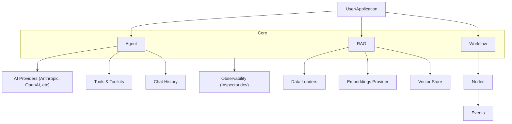

# Neuron AI Documentation Index

Welcome to the Neuron AI documentation! This index provides a quick overview and links to all available sections for easy navigation by AI agents and developers.

## 🚀 Getting Started

- [Introduction](introduction.md) - Framework overview and architecture.
- [Installation](installation.md) - Requirements and initial setup.
- [Upgrade to v3](upgrade.md) - High-impact changes and new features.
- [Video Tutorials](video-tutorials.md) - Articles and learning resources.
- [Agentic Development](agentic-development.md) - Setup for AI assistants (MCP).

## 🤖 Agent

- [Agent](agent.md) - Building and configuring AI entities.
- [Messages](messages.md) - Unified messaging layer and content blocks.
- [Tools & Toolkits](tools.md) - Extending agent capabilities.
- [Chat History](chat-history.md) - Managing conversation memory.
- [Streaming](streaming.md) - Real-time response handling.
- [Structured Output](structured-output.md) - Enforcing JSON schemas.
- [MCP Connector](mcp.md) - Connecting external MCP tools.
- [Middleware](middleware.md) - Hooks and execution control.
- [Async](async.md) - Running agents in async environments.
- [Monitoring & Debugging](monitoring-and-debugging.md) - Observability with Inspector.
- [Error Handling](error-handling.md) - Managing failures.
- [Evaluation](evaluation.md) - Assessing output quality.

## 🔌 Providers

- [AI Provider](ai-provider.md) - Supported LLM engines.
- [Audio](audio.md) - Text-to-speech services.
- [Image](image.md) - Image generation capabilities.

## 📚 RAG (Retrieval-Augmented Generation)

- [RAG Overview](rag.md) - Getting started with internal data.
- [Data Loader](data-loader.md) - Extracting text from files and strings.
- [Embeddings Provider](embeddings-provider.md) - Vectorization services.
- [Vector Store](vector-store.md) - Persistent and in-memory storage.
- [Pre/Post Processor](pre-post-processor.md) - Query transformation and re-ranking.
- [Retrieval](retrieval.md) - Context search strategies.

## 🔄 Workflow

- [Workflow Overview](workflow.md) - Event-driven, node-based orchestration.
- [Single Step Workflow](single-step-workflow.md) - Simple process flows.
- [Multi Step Workflow](multi-step-workflow.md) - Chaining nodes with events.
- [Loops & Branches](loops-branches.md) - Logic and recursion.
- [State Management](state-management.md) - Shared workflow data.
- [Interruption](interruption.md) - Human-in-the-loop patterns.
- [Persistence](persistence.md) - Preserving workflow state.
- [Streaming](workflow-streaming.md) - Real-time updates.
- [Middleware](workflow-middleware.md) - Intercepting workflow nodes.
- [Examples](workflow-examples.md) - Real-world implementations.

## 🛠 Resources

- [Testing](testing.md) - Mocking and assertions.
- [GitHub](github.md) - Source code and community.
- [NeuronHub](neuronhub.dev) - Pre-packaged agents and tools.

---

### Framework Architecture

