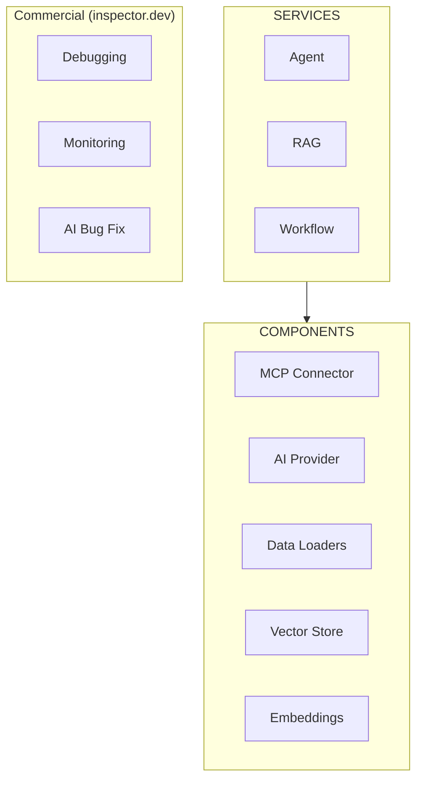

# Introduction

Neuron is a PHP framework for developing agentic applications. By handling the heavy lifting of orchestration, data loading, and debugging, Neuron clears the path for you to focus on the creative soul of your project. From the first line of code to a fully orchestrated multi-agent system, you have the freedom to build AI entities that think and act exactly how you envision them.

We provide tools for the entire agentic application development lifecycle, from LLM interfaces, to data loading, to multi-agent orchestration, to monitoring and debugging. In addition, we provide [tutorials and other educational content](https://docs.neuron-ai.dev/overview/fast-learning-by-video) to help you get started using AI Agents in your projects.

## What is Neuron

Neuron is a PHP framework for developing agentic applications. It provides tools for LLM interfaces, data loading, multi-agent orchestration, monitoring, and debugging.

## Ecosystem

- [E-Book - "Start With AI Agents In PHP"](https://www.amazon.com/dp/B0F1YX8KJB)
- [Newsletter](https://neuron-ai.dev)
- [Forum](https://github.com/inspector-apm/neuron-ai/discussions)
- [Inspector.dev](https://inspector.dev)

## Core Components

- Agent
- AI Provider
- Toolkit
- RAG
- Embeddings Provider
- Data Loader
- Vector Store
- Chat History
- MCP connector
- Monitoring & Debugging
- Pre/Post Processors
- Workflow

## Architecture Diagram

