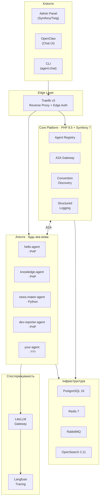
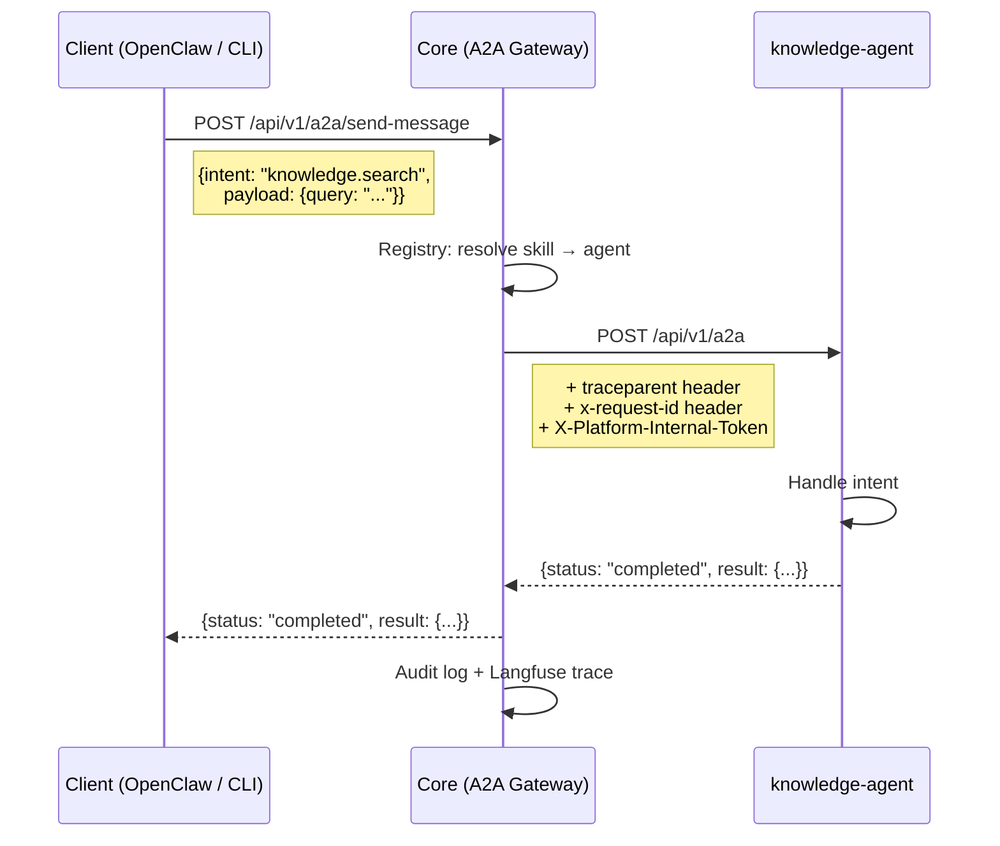
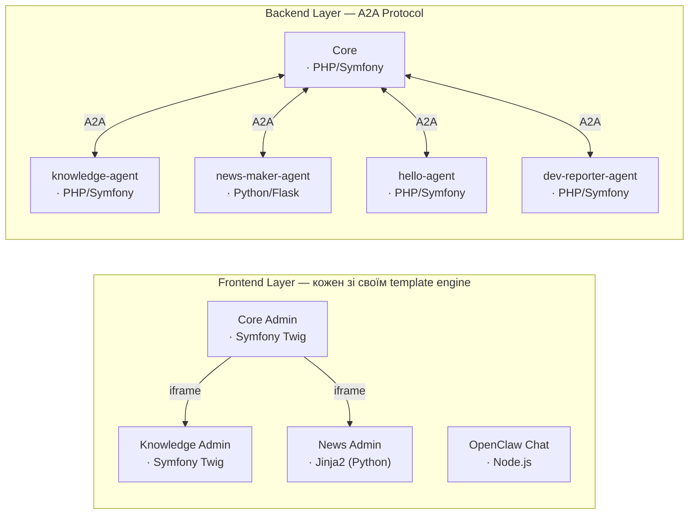
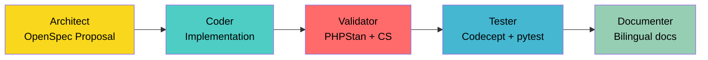

# AI Community Platform

Мультиагентна платформа для спільнот

<div class="pt-12">
  <span class="px-3 py-1.5 rounded-lg text-sm font-medium" style="background: rgba(255,255,255,0.15); backdrop-filter: blur(4px);">
    PHP &middot; Python &middot; TypeScript &mdash; будь-яка мова, один протокол
  </span>
</div>

<div class="abs-bl m-6 text-sm opacity-50">
  Березень 2026 &middot; Прототип
</div>

<!--
Вітаю! Сьогодні я розкажу про AI Community Platform — як ми будуємо мультиагентну систему для спільнот, де кожен агент може бути написаний на будь-якій мові.
-->

---
transition: fade-out
---

# Навіщо ще одна платформа?

<div class="grid grid-cols-2 gap-12 mt-8">
<div>

### Проблема

<div class="space-y-3 mt-4">

<div v-click class="flex items-start gap-2">
  <div class="text-red-400 mt-1 text-lg">&#x2717;</div>
  <div>Кожна спільнота потребує ШІ-інструменти, але <span v-mark.underline.red="1">немає єдиного стандарту</span></div>
</div>

<div v-click class="flex items-start gap-2">
  <div class="text-red-400 mt-1 text-lg">&#x2717;</div>
  <div>Агенти залежать від конкретного фреймворку та мови</div>
</div>

<div v-click class="flex items-start gap-2">
  <div class="text-red-400 mt-1 text-lg">&#x2717;</div>
  <div>Складно контролювати витрати та якість LLM</div>
</div>

<div v-click class="flex items-start gap-2">
  <div class="text-red-400 mt-1 text-lg">&#x2717;</div>
  <div>Спостережуваність доводиться будувати з нуля</div>
</div>

</div>
</div>
<div>

### Рішення

<div class="space-y-3 mt-4">

<div v-click class="flex items-start gap-2">
  <div class="text-green-400 mt-1 text-lg">&#x2713;</div>
  <div><span v-mark.underline.orange="5">Платформа бере інфраструктуру на себе</span></div>
</div>

<div v-click class="flex items-start gap-2">
  <div class="text-green-400 mt-1 text-lg">&#x2713;</div>
  <div>Агент = будь-яка мова, один HTTP-контракт</div>
</div>

<div v-click class="flex items-start gap-2">
  <div class="text-green-400 mt-1 text-lg">&#x2713;</div>
  <div>A2A протокол для взаємодії між агентами</div>
</div>

<div v-click class="flex items-start gap-2">
  <div class="text-green-400 mt-1 text-lg">&#x2713;</div>
  <div>Централізований LLM-шлюз із guardrails</div>
</div>

</div>
</div>
</div>

<div v-click class="mt-8 text-center text-lg opacity-80">

> "WordPress + Plugins" для AI-агентів

</div>

<!--
Як WordPress надає хостинг, авторизацію, базу даних, а ви просто пишете плагін — так само і наша платформа надає все потрібне, а ви пишете лише логіку агента.
-->

---

# Архітектура платформи

<div class="mt-2">



</div>

<!--
Агенти — це незалежні мікросервіси за Traefik. Core виступає як A2A Gateway — маршрутизатор запитів до агентів. Кожен агент може використовувати LiteLLM для доступу до LLM, і всі виклики автоматично трасуються через Langfuse.
-->

---
layout: two-cols
layoutClass: gap-8
---

# A2A Протокол

<div class="space-y-3 mt-6">

<div v-click class="flex items-start gap-2">
  <div class="text-blue-400 font-bold">01</div>
  <div><strong>Agent Card</strong> — паспорт агента<br/><span class="text-sm opacity-70">name, version, skills, capabilities, storage</span></div>
</div>

<div v-click class="flex items-start gap-2">
  <div class="text-blue-400 font-bold">02</div>
  <div><strong>Manifest endpoint</strong><br/><code class="text-sm">GET /api/v1/manifest</code></div>
</div>

<div v-click class="flex items-start gap-2">
  <div class="text-blue-400 font-bold">03</div>
  <div><strong>Task endpoint</strong><br/><code class="text-sm">POST /api/v1/a2a</code></div>
</div>

<div v-click class="flex items-start gap-2">
  <div class="text-blue-400 font-bold">04</div>
  <div>Відповідає <strong>Google A2A spec</strong></div>
</div>

<div v-click class="flex items-start gap-2">
  <div class="text-blue-400 font-bold">05</div>
  <div><span v-mark.circle.orange="5">Stateless, intent-based routing</span></div>
</div>

</div>

::right::

<div class="mt-6">

```php {all|2-4|5|6-9|10-12|all}
// Agent Card (PHP DTO)
final readonly class AgentCard {
  public function __construct(
    public string $name,
    public string $version,
    public array $skills,
    public ?AgentCapabilities $capabilities,
    public ?string $healthUrl,
    public ?string $adminUrl,
    public ?array $storage,
    // postgres, redis, opensearch
    // — платформа провізіонить автоматично
  ) {}
}
```

</div>

<!--
Agent Card — це як package.json для агента. Він описує що агент вміє (skills), які ресурси потребує (storage), де його health check та адмінка. Core читає Agent Card і автоматично реєструє агента.
-->

---

# Як працює A2A виклик

<div class="mt-4">



</div>

<!--
Core маршрутизує по skill ID, а не по імені агента. Будь-який агент може зареєструвати будь-який skill. Traceparent header забезпечує distributed tracing — ви бачите повний шлях запиту від клієнта до агента в Langfuse.
-->

---
layout: two-cols
layoutClass: gap-8
---

# Zero-Boilerplate Onboarding

<div class="space-y-3 mt-6">

<div v-click class="flex items-start gap-2">
  <div class="text-purple-400">1.</div>
  <div>Docker label<br/><code class="text-xs">ai.platform.agent=true</code></div>
</div>

<div v-click class="flex items-start gap-2">
  <div class="text-purple-400">2.</div>
  <div>Traefik API виявляє сервіс</div>
</div>

<div v-click class="flex items-start gap-2">
  <div class="text-purple-400">3.</div>
  <div>Core запитує <code class="text-xs">/api/v1/manifest</code></div>
</div>

<div v-click class="flex items-start gap-2">
  <div class="text-purple-400">4.</div>
  <div>ConventionVerifier перевіряє Agent Card</div>
</div>

<div v-click class="flex items-start gap-2">
  <div class="text-purple-400">5.</div>
  <div><span v-mark.box.green="5">Автоматична реєстрація!</span></div>
</div>

</div>

<div v-click class="mt-6 p-3 bg-green-500/10 rounded text-sm">
Жодного коду в Core.<br/>Просто Docker label + manifest endpoint.
</div>

::right::

<div class="mt-6">

```yaml {all|11|1-2|all}
# compose.agent-hello.yaml
services:
  hello-agent:
    build:
      context: .
      dockerfile: docker/hello-agent/Dockerfile
    labels:
      - traefik.enable=true
      - traefik.http.routers.hello.rule=
          PathPrefix(`/`)
      - ai.platform.agent=true
    environment:
      APP_INTERNAL_TOKEN: ${APP_INTERNAL_TOKEN}
      LITELLM_BASE_URL: http://litellm:4000
      LANGFUSE_BASE_URL: http://langfuse-web:3000
```

</div>

<!--
Це наш момент "WordPress-плагіна". Просто додайте Docker label, реалізуйте manifest endpoint — і платформа вас знайде. Ніяких API-реєстрацій, ніякого коду в Core.
-->

---

# 5 способів взаємодії з агентами

<div class="grid grid-cols-1 gap-4 mt-8">

<div v-click class="flex items-center gap-4 p-3 rounded-lg bg-white/5">
  <div class="text-3xl">&#x1F4AC;</div>
  <div><strong>OpenClaw</strong> — Chat UI з автоматичним tool calling<br/><span class="text-sm opacity-70">Для кінцевих користувачів та тестування</span></div>
</div>

<div v-click class="flex items-center gap-4 p-3 rounded-lg bg-white/5">
  <div class="text-3xl">&#x2328;</div>
  <div><strong>CLI <code>agent:chat</code></strong> — інтерактивний чат у терміналі<br/><span class="text-sm opacity-70">Для розробників, з tool use та streaming</span></div>
</div>

<div v-click class="flex items-center gap-4 p-3 rounded-lg bg-white/5">
  <div class="text-3xl">&#x1F500;</div>
  <div><strong>A2A Curator</strong> — програмний виклик через Core Gateway<br/><span class="text-sm opacity-70">Для agent-to-agent взаємодії</span></div>
</div>

<div v-click class="flex items-center gap-4 p-3 rounded-lg bg-white/5">
  <div class="text-3xl">&#x2699;</div>
  <div><strong>Pipeline Runner</strong> — мультиагентна оркестрація<br/><span class="text-sm opacity-70">Architect → Coder → Validator → Tester → Documenter</span></div>
</div>

<div v-click class="flex items-center gap-4 p-3 rounded-lg bg-white/5">
  <div class="text-3xl">&#x1F310;</div>
  <div><strong>Direct HTTP</strong> — прямий виклик агента як мікросервісу<br/><span class="text-sm opacity-70">Для інтеграцій та автоматизацій</span></div>
</div>

</div>

<!--
Кожен режим для свого use case. OpenClaw — для чату, CLI — для розробки, A2A — для міжагентної взаємодії, Pipeline — для CI/CD-подібних потоків, Direct HTTP — для інтеграцій.
-->

---

# Пиши агента на чому хочеш

Один контракт — різні мови. Анімований перехід:

````md magic-move {lines: true}
```php {*|1-3|4-6|8-13|*}
// PHP Agent (knowledge-agent)
final class KnowledgeA2AHandler {
    public function handle(array $request): array {
        $intent = $request['intent'] ?? '';
        $requestId = $request['request_id'] ?? '';
        $payload = $request['payload'] ?? [];

        return match ($intent) {
            'knowledge.search'
                => $this->handleSearch($payload, $requestId),
            'knowledge.upload'
                => $this->handleExtract($payload, $requestId),
            default
                => ['status' => 'failed', 'error' => "Unknown: $intent"],
        };
    }
}
```

```python {*|1-3|4-5|7-12|*}
# Python Agent (news-maker-agent)
@app.route("/api/v1/a2a", methods=["POST"])
def a2a_handler():
    data = request.get_json()
    intent = data.get("intent", "")

    match intent:
        case "news.curate":
            return curate_news(data["payload"])
        case "news.publish":
            return publish_digest(data["payload"])
        case _:
            return {"status": "failed"}, 400
```
````

<div v-click class="mt-4 text-center text-lg opacity-80">

Платформі байдуже на вашу мову. Реалізуйте manifest + A2A endpoint.

</div>

<!--
Magic Move показує що контракт однаковий для PHP і Python. Можна написати агента на Go, Rust, TypeScript — головне, щоб він відповідав на manifest і A2A запити.
-->

---
layout: two-cols
layoutClass: gap-8
---

# LiteLLM: Guardrails та Cost Control

<div class="space-y-2 mt-6">

<div v-click class="flex items-start gap-2">
  <div class="text-yellow-400 text-lg">&#x26A1;</div>
  <div>Один endpoint для <strong>всіх</strong> LLM</div>
</div>

<div v-click class="flex items-start gap-2">
  <div class="text-yellow-400 text-lg">&#x2696;</div>
  <div><code>least-busy</code> load balancing</div>
</div>

<div v-click class="flex items-start gap-2">
  <div class="text-yellow-400 text-lg">&#x1F504;</div>
  <div>Auto-retry при 429 + cooldown</div>
</div>

<div v-click class="flex items-start gap-2">
  <div class="text-yellow-400 text-lg">&#x1F6E1;</div>
  <div><span v-mark.underline.red="4">Guardrails</span>: rpm/tpm per model</div>
</div>

<div v-click class="flex items-start gap-2">
  <div class="text-yellow-400 text-lg">&#x1F4B0;</div>
  <div>Model aliases: <code>free</code>, <code>cheap</code>, <code>primary</code></div>
</div>

<div v-click class="flex items-start gap-2">
  <div class="text-yellow-400 text-lg">&#x1F4CA;</div>
  <div>Spend tracking per agent/method</div>
</div>

</div>

::right::

<div class="mt-6">

```yaml {all|1-4|6-10|12-16|18-20|all}
# docker/litellm/config.yaml
model_list:
  - model_name: free
    litellm_params:
      model: openrouter/deepseek/deepseek-v3.2:free
      rpm: 20    # requests per minute
      tpm: 50000 # tokens per minute

  - model_name: cheap
    litellm_params:
      model: openrouter/deepseek/deepseek-v3.2
      # $0.25/M input, $0.40/M output

router_settings:
  routing_strategy: "least-busy"
  num_retries: 3
  cooldown_time: 60
  enable_pre_call_checks: true

litellm_settings:
  success_callback: ["langfuse"]
  failure_callback: ["langfuse"]
```

</div>

<!--
Кожен агент звертається до LiteLLM, а не до OpenAI напряму. Адміни контролюють які моделі доступні, бюджети, rate limits. Model aliases (free, cheap) дозволяють агентам обирати цінові тіри.
-->

---

# Langfuse: Трасування та якість

<div class="grid grid-cols-2 gap-8 mt-6">
<div>

<div class="space-y-3">

<div v-click class="flex items-start gap-2">
  <div class="text-cyan-400 text-lg">&#x1F50D;</div>
  <div>Кожен A2A виклик = <strong>trace</strong> в Langfuse</div>
</div>

<div v-click class="flex items-start gap-2">
  <div class="text-cyan-400 text-lg">&#x1F517;</div>
  <div>W3C Trace Context: <code>traceparent</code> header</div>
</div>

<div v-click class="flex items-start gap-2">
  <div class="text-cyan-400 text-lg">&#x2699;</div>
  <div>LiteLLM <strong>автоматично</strong> логує LLM виклики</div>
</div>

<div v-click class="flex items-start gap-2">
  <div class="text-cyan-400 text-lg">&#x1F4CE;</div>
  <div>Агенти додають власні <strong>spans</strong></div>
</div>

<div v-click class="flex items-start gap-2">
  <div class="text-cyan-400 text-lg">&#x1F4CA;</div>
  <div>Метрики: latency, tokens, cost, errors</div>
</div>

</div>

</div>
<div>

```php {all|2-5|6-9|all}
// LangfuseIngestionClient — Core
public function recordA2ACall(
    string $traceId,
    string $requestId,
    string $tool,
    string $agent,
    int $durationMs,
    string $status,
    int $httpStatusCode,
    array $input,
    array $result,
): void {
    // Автоматично створює trace + span
    // в Langfuse для кожного A2A виклику
    $this->ingest([
        $this->spanCreateEvent(...)
    ]);
}
```

</div>
</div>

<div v-click class="mt-4 p-3 bg-cyan-500/10 rounded text-sm text-center">
Два шляхи інтеграції: LiteLLM callbacks (LLM generations) + LangfuseIngestionClient (A2A orchestration).<br/>Обидва корелюються через спільний <code>trace_id</code>.
</div>

<!--
Langfuse інтеграція автоматична. Кожен A2A виклик записується. Платформа використовує це для моніторингу якості, відстеження витрат, та дебагу. W3C traceparent header забезпечує full distributed tracing.
-->

---

# Спеціалізований логер

<div class="grid grid-cols-2 gap-8 mt-6">
<div>

```php {all|1-2|4-8|10-14|all}
// Structured trace events
final class TraceEvent {
    public static function build(
        string $eventName,
        // "core.a2a.outbound.completed"
        string $step,
        // "a2a_outbound"
        string $sourceApp,
        // "core" | "knowledge-agent" | ...
        string $status,
        // "completed" | "failed"
        array $context = [],
    ): array {
        return [
            'event_name' => $eventName,
            'step' => $step,
            'source_app' => $sourceApp,
            'status' => $status,
            'sequence_order' => microtime(true),
            ...$context,
        ];
    }
}
```

</div>
<div>

<div class="space-y-4 mt-2">

<div v-click class="p-3 bg-white/5 rounded">
  <div class="font-bold text-orange-300">OpenSearch</div>
  <div class="text-sm opacity-80">Повнотекстовий пошук по логах, daily indices</div>
</div>

<div v-click class="p-3 bg-white/5 rounded">
  <div class="font-bold text-orange-300">PayloadSanitizer</div>
  <div class="text-sm opacity-80">Автоматичне маскування: token, api_key, password, secret, cookie</div>
</div>

<div v-click class="p-3 bg-white/5 rounded">
  <div class="font-bold text-orange-300">Trace Waterfall</div>
  <div class="text-sm opacity-80">Відстеження по trace_id у адмін-панелі</div>
</div>

<div v-click class="p-3 bg-white/5 rounded">
  <div class="font-bold text-orange-300">Єдина схема</div>
  <div class="text-sm opacity-80">event_name, step, source_app, status — для всіх агентів</div>
</div>

</div>

</div>
</div>

<!--
Кастомна інфраструктура логування на OpenSearch. Кожен запис має event_name, step, source_app, trace_id, request_id. PayloadSanitizer гарантує що секрети не потрапляють в логи.
-->

---
layout: two-cols
layoutClass: gap-8
---

# Адмін-панель

<div class="space-y-2 mt-6">

<div v-click class="flex items-start gap-2 text-sm">
  <div class="text-green-400">&#x25CF;</div>
  <div>Dashboard із загальним станом</div>
</div>

<div v-click class="flex items-start gap-2 text-sm">
  <div class="text-green-400">&#x25CF;</div>
  <div>Реєстр агентів (auto-discovery)</div>
</div>

<div v-click class="flex items-start gap-2 text-sm">
  <div class="text-green-400">&#x25CF;</div>
  <div>Enable / Disable одним кліком</div>
</div>

<div v-click class="flex items-start gap-2 text-sm">
  <div class="text-green-400">&#x25CF;</div>
  <div>Agent Card viewer: skills, version</div>
</div>

<div v-click class="flex items-start gap-2 text-sm">
  <div class="text-green-400">&#x25CF;</div>
  <div>Конфігурація: system prompt, params</div>
</div>

<div v-click class="flex items-start gap-2 text-sm">
  <div class="text-green-400">&#x25CF;</div>
  <div><strong>iframe embedding</strong> — кожен агент зі своєю адмінкою</div>
</div>

<div v-click class="flex items-start gap-2 text-sm">
  <div class="text-green-400">&#x25CF;</div>
  <div>Convention violations dashboard</div>
</div>

</div>

::right::

<div class="mt-6">

```twig {all|1-5|7-12|14-18|all}
{# Agent Settings — Twig template #}

  <div class="badge">
    Has own storage (provisioned)
  </div>


{# iFrame: Agent's own admin UI #}

  <iframe
    src="{{ agent.adminUrl }}?embedded=1"
    title="{{ agent.name }} Admin">
  </iframe>


{# Per-agent configuration #}
<label>System Prompt</label>
<textarea id="systemPrompt">
  {{ config.system_prompt ?? '' }}
</textarea>
```

</div>

<!--
Кожен агент з admin_url у своєму Agent Card отримує власну вкладку в адмінці через iframe. Платформа централізовано обробляє авторизацію через Traefik Edge Auth.
-->

---

# Мікросервіси скрізь

<div class="mt-4">



</div>

<div class="grid grid-cols-3 gap-4 mt-4">

<div v-click class="p-2 bg-white/5 rounded text-sm text-center">
  Кожен агент —<br/><strong>окремий Docker-контейнер</strong>
</div>

<div v-click class="p-2 bg-white/5 rounded text-sm text-center">
  Єдина авторизація<br/><strong>Traefik Edge Auth</strong>
</div>

<div v-click class="p-2 bg-white/5 rounded text-sm text-center">
  Фронтенд — теж<br/><strong>мікросервіси (iframe)</strong>
</div>

</div>

<!--
Мікросервісний підхід не тільки для бекенду, але й для фронтенду. Кожен агент може мати свою адмін-панель зі своїм template engine. Core Admin вбудовує їх через iframe.
-->

---

# Pipeline: 5 агентів, одне завдання

<div class="mt-4">



</div>

<div class="grid grid-cols-3 gap-4 mt-6">

<div v-click class="p-3 bg-white/5 rounded text-sm">
  <div class="font-bold text-yellow-300 mb-1">Handoff File</div>
  Передача контексту між агентами через handoff.md
</div>

<div v-click class="p-3 bg-white/5 rounded text-sm">
  <div class="font-bold text-yellow-300 mb-1">Model Fallback</div>
  subscription → free → cheap — автоматичний перехід при rate limit
</div>

<div v-click class="p-3 bg-white/5 rounded text-sm">
  <div class="font-bold text-yellow-300 mb-1">Parallel Execution</div>
  Ізольовані git worktrees для паралельних задач
</div>

<div v-click class="p-3 bg-white/5 rounded text-sm">
  <div class="font-bold text-yellow-300 mb-1">Auto-commit</div>
  Після кожного етапу — git commit з метаданими
</div>

<div v-click class="p-3 bg-white/5 rounded text-sm">
  <div class="font-bold text-yellow-300 mb-1">Notifications</div>
  Telegram / Webhook на кожному етапі
</div>

<div v-click class="p-3 bg-white/5 rounded text-sm">
  <div class="font-bold text-yellow-300 mb-1">Dev Reporter</div>
  Метрики пайплайну → A2A → DB + Telegram
</div>

</div>

<!--
Це CI/CD для AI-розробки. Кожен агент має спеціалізовану роль. Handoff.md передає контекст між агентами. Model fallback chain гарантує що пайплайн завершиться навіть при rate limits.
-->

---

# Наші агенти

<div class="mt-6">

| Агент | Мова | Призначення | Skills |
|---|---|---|---|
| <span v-click>**hello-agent**</span> | <span v-click>PHP</span> | <span v-click>Reference implementation</span> | <span v-click>`hello.greet`</span> |
| <span v-click>**knowledge-agent**</span> | <span v-click>PHP</span> | <span v-click>Пошук та збереження знань</span> | <span v-click>`knowledge.search`, `.upload`, `.store_message`</span> |
| <span v-click>**news-maker-agent**</span> | <span v-click>Python</span> | <span v-click>Курування та публікація новин</span> | <span v-click>`news.curate`, `news.publish`</span> |
| <span v-click>**dev-reporter-agent**</span> | <span v-click>PHP</span> | <span v-click>Спостережуваність пайплайнів</span> | <span v-click>`devreporter.ingest`, `.status`, `.notify`</span> |
| <span v-click>**core**</span> | <span v-click>PHP</span> | <span v-click>Gateway, Registry, Auth</span> | <span v-click>(internal routing)</span> |

</div>

<div v-click class="mt-6 p-3 bg-blue-500/10 rounded text-center">

**hello-agent** — мінімальний reference для нових розробників (скопіюй і почни)

**knowledge-agent** — async processing через RabbitMQ workers

**news-maker-agent** — proof що Python агент працює разом з PHP

</div>

<!--
hello-agent — це ваш стартер. Скопіюйте його, замініть логіку, і у вас новий агент. knowledge-agent показує async через RabbitMQ. news-maker — що платформа дійсно мультимовна.
-->

---
layout: two-cols
layoutClass: gap-8
---

# Гнучкі налаштування

<div class="space-y-3 mt-6">

<div v-click class="flex items-start gap-2 text-sm">
  <div class="text-teal-400 font-bold">&#x2605;</div>
  <div><code>config_schema</code> в Agent Card — JSON Schema для налаштувань</div>
</div>

<div v-click class="flex items-start gap-2 text-sm">
  <div class="text-teal-400 font-bold">&#x2605;</div>
  <div>System prompt — per-agent LLM поведінка</div>
</div>

<div v-click class="flex items-start gap-2 text-sm">
  <div class="text-teal-400 font-bold">&#x2605;</div>
  <div>Enable/Disable без зупинки платформи</div>
</div>

<div v-click class="flex items-start gap-2 text-sm">
  <div class="text-teal-400 font-bold">&#x2605;</div>
  <div><strong>Storage provisioning</strong> — DB per agent</div>
</div>

<div v-click class="flex items-start gap-2 text-sm">
  <div class="text-teal-400 font-bold">&#x2605;</div>
  <div>Startup migrations — автоматично при старті</div>
</div>

</div>

::right::

<div class="mt-6">

```yaml {all|1-4|5-10|all}
# Agent Card: storage section
storage:
  postgres:
    db_name: knowledge_agent
    startup_migration:
      enabled: true
      command: >
        php bin/console
        doctrine:migrations:migrate
        --no-interaction
      mode: best_effort

# Платформа автоматично:
# 1. CREATE DATABASE knowledge_agent
# 2. CREATE USER knowledge_agent
# 3. Виконує startup_migration
```

</div>

<div v-click class="mt-4 p-2 bg-teal-500/10 rounded text-sm">
Config зберігається в JSONB у <code>agent_registry</code> таблиці Core. Не в агенті — в платформі.
</div>

<!--
Коли ви вмикаєте агент із storage.postgres, платформа створює базу, користувача, і запускає міграції автоматично. Конфігурація зберігається в Core — при рестарті агент отримує свої налаштування з платформи.
-->

---

# Що далі?

<div class="grid grid-cols-3 gap-6 mt-8">

<div class="space-y-3">
  <div class="text-lg font-bold text-amber-300">В розробці</div>

  <div v-click class="p-2 bg-amber-500/10 rounded text-sm">
    Central Scheduler — планування задач з manifest
  </div>

  <div v-click class="p-2 bg-amber-500/10 rounded text-sm">
    Workflow Engine — мультикрокові сценарії (YAML)
  </div>

  <div v-click class="p-2 bg-amber-500/10 rounded text-sm">
    Deep Crawling — 2-рівневий рекурсивний парсинг
  </div>
</div>

<div class="space-y-3">
  <div class="text-lg font-bold text-blue-300">Заплановано</div>

  <div v-click class="p-2 bg-blue-500/10 rounded text-sm">
    <span v-mark.circle.orange="7">Agent Marketplace</span>
  </div>

  <div v-click class="p-2 bg-blue-500/10 rounded text-sm">
    Anti-fraud signals agent
  </div>

  <div v-click class="p-2 bg-blue-500/10 rounded text-sm">
    Discussion Summarization
  </div>
</div>

<div class="space-y-3">
  <div class="text-lg font-bold text-green-300">Візія</div>

  <div v-click class="p-2 bg-green-500/10 rounded text-sm">
    Спільноти самостійно обирають агентів
  </div>

  <div v-click class="p-2 bg-green-500/10 rounded text-sm">
    Маркетплейс від різних розробників
  </div>

  <div v-click class="p-2 bg-green-500/10 rounded text-sm">
    Enterprise-ready multi-tenant
  </div>
</div>

</div>

<!--
Архітектура прототипу вже production-grade. Marketplace означає що будь-який розробник може створити агента, опублікувати його, і спільноти зможуть його встановити як WordPress-плагін.
-->

---
layout: center
class: text-center
---

# Питання?

<div class="text-xl mt-6 opacity-80">
  AI Community Platform
</div>

<div class="mt-6 grid grid-cols-5 gap-4 text-xs opacity-60 max-w-xl mx-auto">
  <div>PHP 8.5<br/>Symfony 7</div>
  <div>Python<br/>Flask</div>
  <div>A2A<br/>Protocol</div>
  <div>LiteLLM<br/>Gateway</div>
  <div>Langfuse<br/>Tracing</div>
</div>

<div class="mt-8 text-sm opacity-40">
  Docker Compose &middot; Traefik &middot; PostgreSQL &middot; Redis &middot; RabbitMQ &middot; OpenSearch
</div>

<!--
Відкриті для питань. Ключові теми для Q&A: чому не LangGraph/CrewAI (vendor lock-in vs protocol-based), чому Traefik (Docker-native discovery), вартість запуску платформи.
-->
